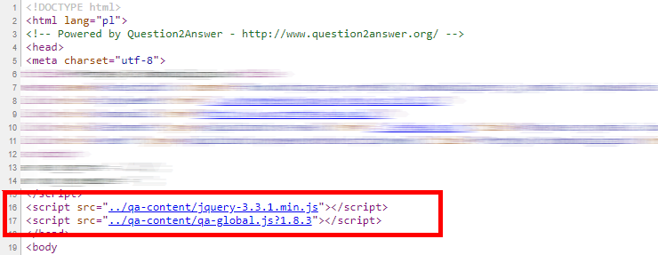
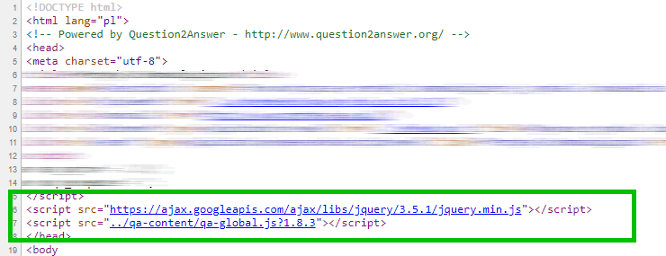
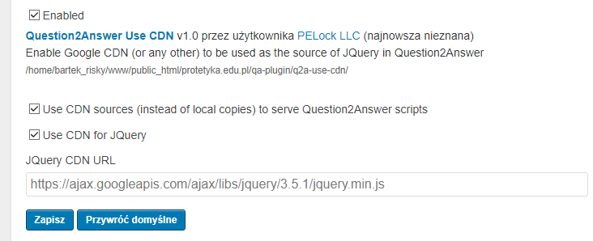

# Question2Answer - Use JQuery CDN Plugin
A small, but useful plugin for Question2Answer v1.8 (and v1.7) system to enable the CDN (Content Delivery Network) usage for JQuery.

## CDN? What it does?
 
It's simple. It replaces default JavaScript JQuery source from the local file to the hosted CDN.

### Before - JQuery script without CDN

### After - JQuery script with Google CDN

## How to use it?

Go to the **Admin Panel** -> **Plugins** and enable it. That's it!

## Why to use CDN?

1. To make your site faster (check it in Google Lighthouse) it's better for SEO. Google CDN is really fast to load.
2. To save your server bandwidth. JQuery minimized is around 30kb. Multiply that by number of the visitors to your site.
3. To use cached copies of the same scripts used by millions of people.
3. You can always make sure you're using the latest version of the scripts (you can specify your own CDN source).

## Changes

* v1.0 - Initial release

Bartosz Wójcik

* Visit my site at — https://www.pelock.com
* Twitter — https://twitter.com/PELock
* GitHub — https://github.com/PELock